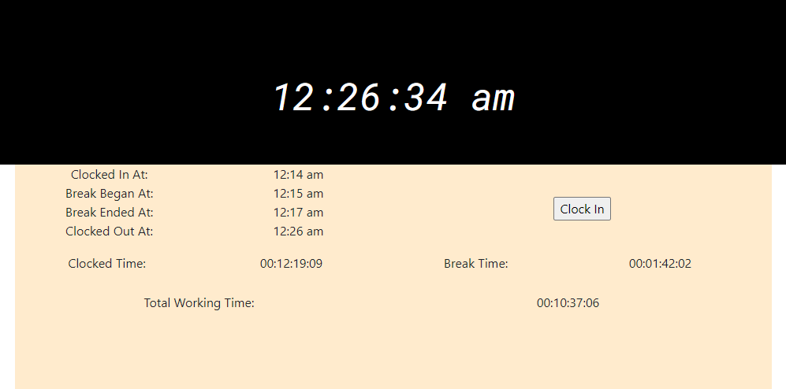

# timeClock

## Description
A simple project that I hope to grow into a larger application. Right now it's just a clock with a few adjustments. At present it is a very basic punchclock- the user pushes buttons to clock in, clock out, start a break, end a break, and end their shift.

## Table of Contents 

* [Installation](#installation)

* [Usage](#usage)

* [Contributing](#contributing)

* [Tests](#tests)

* [PROGRESS](#progress)

* [Questions](#questions)

## Installation

At present this is a very simple application. No installation is necessary. Just run it from the index.html file.

## Usage

Feel free to use this program however you see fit. 

  
## Contributing

If you want to reach me for whatever reason please feel free to email me at erion3k@gmail.com.

## Tests

There are no tests for this application at the moment.

## PROGRESS

0.02 : Basic functionality achieved. App tells current time, tallies clocked-in time, tallies break time, and subtracts the break time from the clocked time. It displays the total clocked in time and lets the user start the day over again. Currently utilizing local storage until I get the database portion up and running. The UX is very, very bad at the moment as I've been more focused on functionality than appearance.

## Questions

If you have any questions about the repo, open an issue or contact me directly at erion3k@gmail.com. You can find more of my work at [ERion42](https://github.com/ERion42/).

